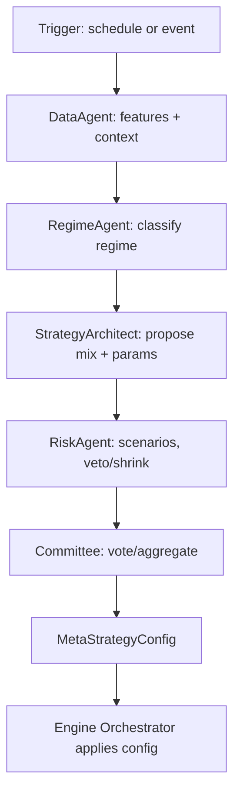
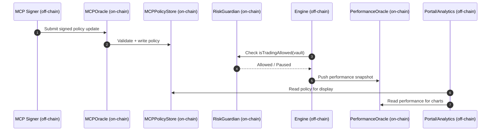
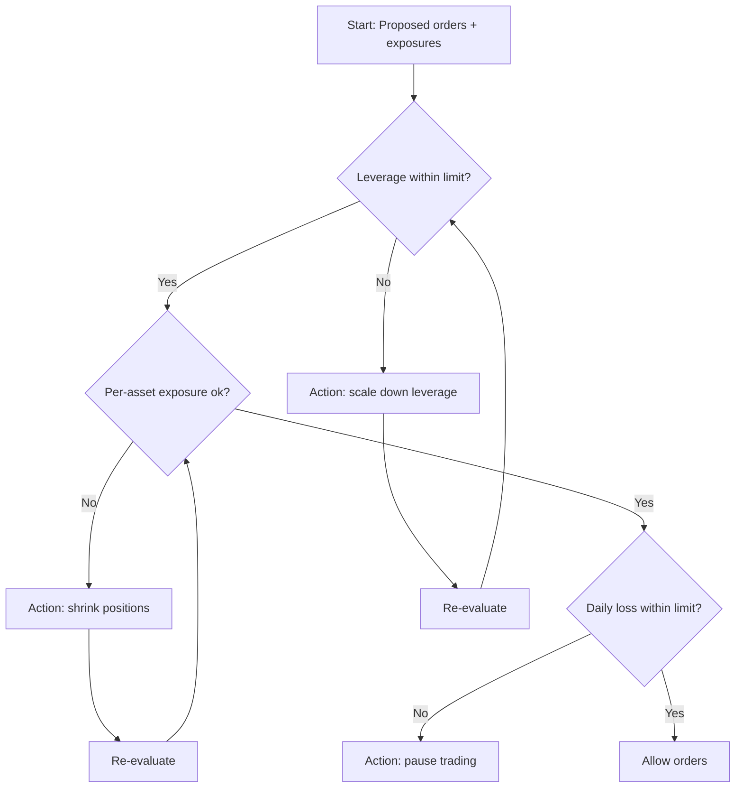

# HydraGrid Diagrams and Flow Trees

This document centralizes system diagrams, color legend, and key flow trees. Colors are consistent across sections and match the README repo map.

## Color legend

| Domain | Color |
|---|---|
| Data | #1f77b4 |
| Engine | #17a2b8 |
| Strategies | #6f42c1 |
| Risk | #d9534f |
| Swarm (AI/MCP) | #ff7f0e |
| Analytics | #2ca02c |
| Infra/API | #6c757d |
| On-chain | #8c564b |

Mermaid class definitions used below:

```mermaid
%%{init: { 'theme': 'base', 'themeVariables': { 'primaryColor': '#1b2a41', 'fontSize': '14px', 'fontFamily': 'Inter, Segoe UI, Arial' }}}%%
%% Reusable classes
classDef pkgData fill:#1f77b4,stroke:#0e4d74,color:#fff;
classDef pkgEngine fill:#17a2b8,stroke:#0c6d78,color:#fff;
classDef pkgStrategies fill:#6f42c1,stroke:#4b2d86,color:#fff;
classDef pkgRisk fill:#d9534f,stroke:#9e2d29,color:#fff;
classDef pkgSwarm fill:#ff7f0e,stroke:#b35800,color:#fff;
classDef pkgAnalytics fill:#2ca02c,stroke:#1d6f1d,color:#fff;
classDef pkgInfra fill:#6c757d,stroke:#444b50,color:#fff;
classDef pkgOnchain fill:#8c564b,stroke:#5c3a33,color:#fff;
```

---

## System architecture (layered overview)

```mermaid
%%{init: { 'theme': 'base' } }%%
graph TB
    subgraph DATA[Data pipelines]
      DP[hYdragrid_data]\nEquities/Futures Ingest]:::pkgData
    end

    subgraph ENGINE[Engine core]
      EC[unykornx_engine\nOrders/Portfolio/Exec]:::pkgEngine
    end

    subgraph STRAT[Strategies]
      SS[Stock strategies]:::pkgStrategies
      SE[Energy strategies]:::pkgStrategies
    end

    subgraph RISK[Risk]
      RK[Limits/Scenarios/Metrics]:::pkgRisk
    end

    subgraph SWARM[Swarm (AI/MCP)]
      SW[Agents + Committee]:::pkgSwarm
    end

    subgraph ANALYTICS[Analytics]
      AN[Metrics/Reports]:::pkgAnalytics
    end

    subgraph INFRA[Infra/API]
      API[FastAPI + Workers]:::pkgInfra
    end

    subgraph PORTAL[Web Portal]
      UI[Dashboard]:::pkgInfra
    end

    subgraph ONCHAIN[On-chain Control Plane]
      OC[Vault/Policy/Oracles]:::pkgOnchain
    end

    DP --> EC
    EC --> SS
    EC --> SE
    SS --> RK
    SE --> RK
    RK --> EC
    SW --> EC
    EC --> AN
    AN --> UI
    API --> UI
    EC --> API
    SW --> OC
    EC -. policy/perf .-> OC
```

---

## End-to-end data and execution flow

```mermaid
flowchart LR
    A[Ingest raw market data]:::pkgData --> B[Feature engineering]:::pkgData
    B --> C[Strategies produce signals]:::pkgStrategies
    C --> D[Risk checks (limits, scenarios)]:::pkgRisk
    D --> E[Order queue + routing]:::pkgEngine
    E --> F[Venue execution (sim/live)]:::pkgEngine
    F --> G[Positions, PnL, metrics]:::pkgAnalytics
    G --> H[API + Portal]:::pkgInfra

    class A,B pkgData;
    class C pkgStrategies;
    class D pkgRisk;
    class E,F pkgEngine;
    class G pkgAnalytics;
    class H pkgInfra;
```

---

## Swarm decision cycle (flow tree)



---

## On-chain control plane (sequence)



---

## Risk policy decision tree


